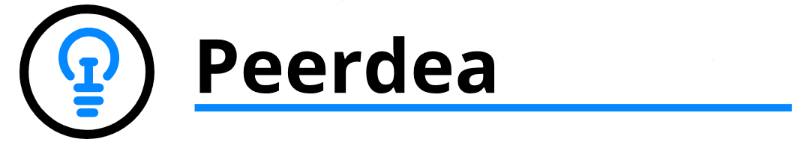
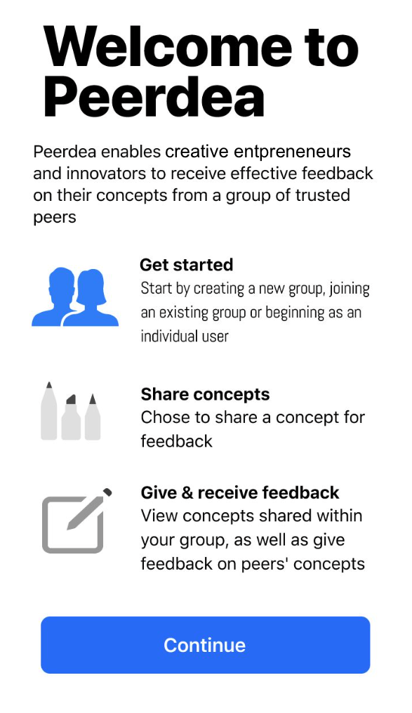
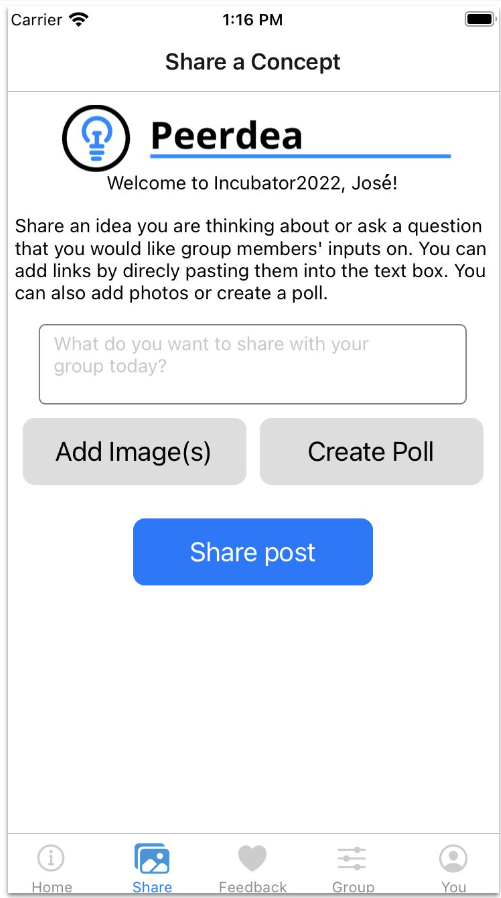
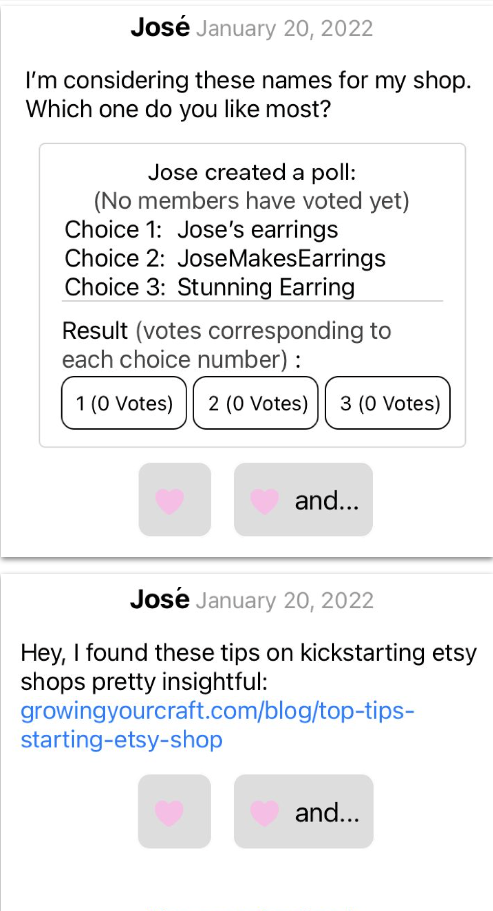

# Peerdea 

<a href="https://peerdea.app/" target="_blank">Peerdea</a> is a trusted environment for entrepreneurs to reflect and receive peer feedback. It provides entrepreneurs social support for their business and professional development.

<span float="left">
    
    
    
</span>

## Table of Contents
1. [Peerdea workflow](#workflow)
2. [Installation](#installation)
    1. [Installing Necessary Packages](#packages)
    2. [Setting up the environment](#environment)
    2. [Hosting Peerdea on cloud server](#hosting)
    3. [Setting up your environment](#environment-variables)
    4. [Troubleshooting](#troubleshooting)
3. [Available Scripts](#scripts)
4. [Tools used](#tools)
5. [Updates for deprecated packages (as of 07/02/2021)](#deprecated)
6. [Contributors](#contributors)

## Peerdea workflow <a name="workflow"></a>

1. Once a user creates an account, they will be prompted to create a new group or join an existing group.
2. Once the user creates or joins a group, they are then guided to share a design concept.
    1. If they choose to share, they can include a series of images to capture their concept (photos of sketches, prototypes, completed designs), as well aas a short story to describe their concept. 
    2. Whether they share a concept or not, the user is able to view all of the concepts shared within their group, as well as give feedback on their peers' concepts.
3. Feedback exchange is possible in two ways:
    1. a simple "Yes" or "Heart" to show quick encouragement on a peer's concept, or
    2. a "Yes and..." where in addition to showing encouragement, the feedback giver is able to offer text-based feedback (the "and..." portion).
        1. Text-based feedback exchanges are scaffolded with two different sentence starters ("I like..." and "I wish..."). All completed "ands..." are then displayed following each concept.

## Installation <a name="installation"></a>
For a more comprehensive guide for Windows/Android, please check [here](https://docs.google.com/document/d/10nijY36HjBxHVvjykHY7Cnic-TviXbasAT7pGxNDR3M/edit). Otherwise, continue for a guide that covers a lot of Mac/Windows.

### Installing Necessary Packages <a name="packages"></a>

#### Windows Prerequisites
For Windows, before doing anything, you want to make sure _Windows Subsystem for Linux_ is installed. A guide for doing so can be found [here](https://docs.microsoft.com/en-us/windows/wsl/install).

#### Mac Prerequisites
For Mac, you will need to run this within a terminal:
```
xcode-select --install
```
You can verify if it succeeded by running `xcode-select -p` and have it return a file path. It will install a package around 1.2GB in size. 

Alternatively, you can download brew, a package management system that is often used for Mac:
```
/bin/bash -c "$(curl -fsSL https://raw.githubusercontent.com/Homebrew/install/HEAD/install.sh)"
```
To check installation, you can run `brew doctor`.

For Expo to run, you will also need to install [watchman](https://formulae.brew.sh/formula/watchman). With brew installed, this is pretty simple; all you need to do is run `brew install watchman`.

#### Packages needed for both

For both, you will want to make sure you have a few packages already installed:
- [Node Version Manager](https://github.com/nvm-sh/nvm#install--update-script) or plain [Node](https://nodejs.org/en/)
  - Generally speaking, downloading the LTS version of Node.js should work fine, but using NVM helps with backward compatibility. 
  - For NVM on Mac, you may need to run `touch ~/.zshrc` before running the install script in order to use the script in the future. See their [Troubleshooting on Mac](https://github.com/nvm-sh/nvm#troubleshooting-on-macos) section for more information
- [Git](https://git-scm.com/book/en/v2/Getting-Started-Installing-Git)

On your phone, you will want to install the _Expo Go_ app in order to test the app on your mobile device.
- For Android, download from [this link](https://play.google.com/store/apps/details?id=host.exp.exponent&hl=en_US&gl=US)
- For iOS, download from [here](https://apps.apple.com/us/app/expo-go/id982107779)

After, you should have everything you need to start setting up your environment

### Setting up the environment <a name="environment"></a>
First, you will want to download the repo, which can be done using:
```
git clone https://github.com/ykotturi/peerdea.git
```
and then use `cd peerdea` to change to the directory.

After, you will:
1. Run `npm install --global expo-cli` to install Expo as necessary
2. Run `npm install` in the root directory (`/peerdea/`)
3. `cd peerdea-native` and run `npm install`
4. `cd ..` (to return to the previous directory), `cd backend` and run `npm install` again.

You can test the app by running:
```
npm start
```
in the root directory. While running this, make sure your phone and your laptop **are on the same network**, and you're not using any VPNs (especially if you're using LAN in developer tools).  You will want to open up a QR scanner, and then use that to open the Expo app. It should start loading.

### Hosting Peerdea on cloud server <a name="hosting"></a>
To host Peerdea on a cloud server, we used Azure via Docker.

Here are a few helpful links to help you get started:
1. https://docs.docker.com/compose/
2. https://docs.docker.com/compose/gettingstarted/
3. https://docs.docker.com/cloud/aci-integration/

### Setting up your environment variables <a name="environment-variables"></a>
Right now, the way to set up a testing environment is a bit of a manual process.

1. In `backend\server.js`, change the `API_PORT` from 80 to 8000 in order to test locally.
3. You will need to set up 2 `.env` files for your environment variables:
    1. In `peerdea-native`, set up a `.env` file with the variables:
        1. `DOCKER_URL`: To do so, you can run `ipconfig getifaddr en1` in your terminal. Get that IP address, and add it to the file with the port so that it looks something like: `127.0.0.1:8000`
    2. In `backend`, set up a `.env` file with the variables:
        1. `DB_ROUTE`: You can [install MongoDB](https://docs.mongodb.com/manual/installation/). Note that on Mac you can use `brew` to do so. After, you can use your own [connection string](https://docs.mongodb.com/manual/reference/connection-string/) for this variable.
        2. `DOCKER_HOST`: This variable is the IP address of your Azure instance.

### Troublshooting <a name="troubleshooting"></a>
When launching Peerdea from a new isntallation, you may get an error that goes something like `Unable to resolve module ./zlib_bindings from /Users/yasminekotturi/Documents/peerdea/peerdea-native/node_modules/zlib/lib/zlib.`. To fix this you will want to comment out the entire file in `peerdea/peerdea-native/node_modules/zlib/libzlib.js`.

If nothing opens when you try to open the app, you may need to update Expo (as of 03/18, master branch is running Expo 40). To update, you will first want to be in the `/peerdea/peerdea-native` directory. From there, run `expo install VERSION_NUMBER`. Currently, versions 43 or 44 advised. Expo also **strongly** recommends you upgrade incrementally (i.e. upgrade to 41, then 42, etc.)

_More to be added as issues come up_

## Available Scripts <a name="scripts"></a>

In the project directory, you can run:

### `npm start` to start the application

### `npm test` to run backend testing

### `npm install` to install necessary dependencies

## Tools used <a name="tools"></a>

- React Native via Expo
- Mocha
- Travis CI
- Express
- MongoDB
- Mongoose
- Azure
- GraphQL

### Updates for deprecated packages (as of 07/02/2021) <a name="deprecated"></a>

The back end was slightly updated to select an option for a deprecated feature of Mongoose.

With this build, there will be two main errors on the front end:

1. `[Unhandled promise rejection: Error: The Expo push notification service is supported only for Expo projects...]`
2. `currentlyFocusedField is deprecated and will be removed in a future release. Use currentlyFocusedInput`

To fix the first one, you'll have to create an expo account [here](http://expo.io), use `expo login`, and login with your account info.

For the second one, you'll have to navigate to `peerdea-native/node_modules/@react-navigation/native/src/createKeyboardAwareNavigator.js` and change all functions that are `currentlyFocusedField()` to `currentlyFocusedInput()`.

## Contributors <a name="contributors"></a>

Peerdea's current team of contributors: Harvey Zheng, Clara Lam, Emmaline Mai, Pranav Khadpe, Jenny Yu, led by Yasmine Kotturi (Ph.D. Human-Computer Interaction).